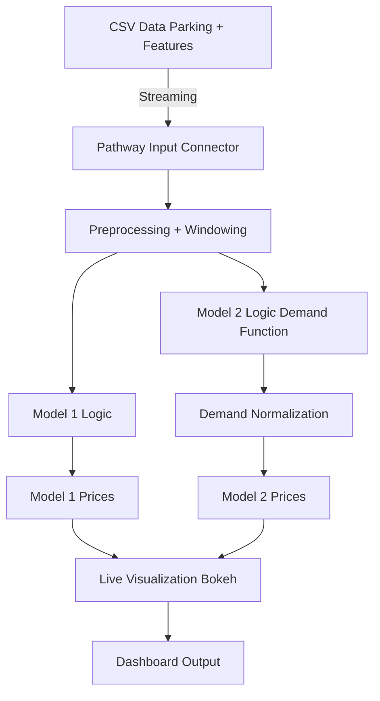

 **Capstone Project | Summer Analytics 2025**  

---

## Project Overview

Urban parking is a critical and scarce resource. Static pricing fails to account for real-time fluctuations in demand, resulting in overuse or underutilization of spaces.

The goal
---

## Tech Stack

| Tool | Purpose |
|------|---------|
| **Python (NumPy, Pandas, DateTime)** | Core computation, demand modeling |
| **Bokeh** | Real-time price visualization |
| **Pathway** | Real-time data simulation |
| **Google Colab** | Notebook development |

---

##  Features Implemented

- 📈 **Model 1:** Simple linear price increase with occupancy  
- 📊 **Model 2:** Demand function based on occupancy, queue, traffic, events & vehicle type  
- ⏱ **Real-Time Simulation:** Pathway streams data by timestamp and processes incrementally  
- 📍 **Lot-level logic:** Prices are computed per lot, per day  
- 📉 **Live dashboard:** Bokeh + Panel visualizations with time-series plots  
- 🧠 **Demand Normalization:** Ensures smooth price changes

---

## Architecture Diagram (Mermaid)

